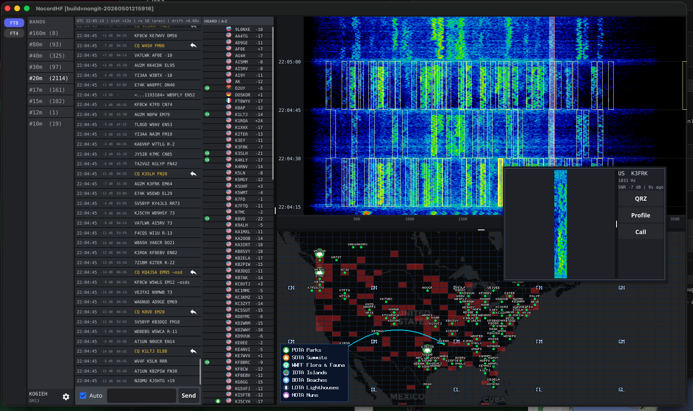
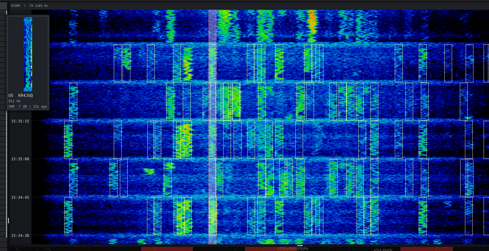
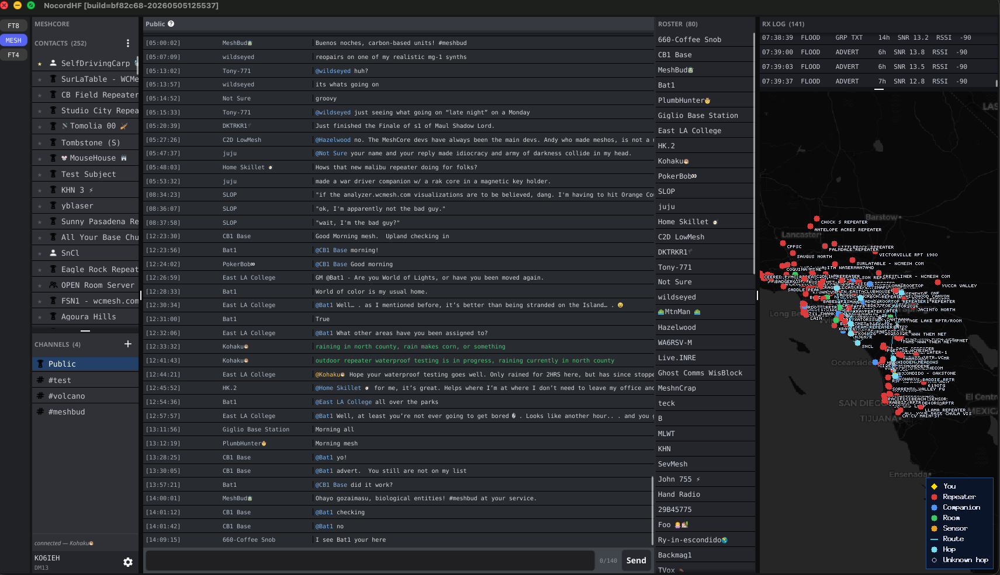

# NocordHF

A Discord-style chat-focused client for amateur radio modes. Two
applications in one binary:

- **FT8** — pure-Go FT8 modem with live waterfall, decode chat,
  HEARD sidebar, DXCC map, and ADIF / LoTW logging.
- **MeshCore** — connect to a MeshCore companion-radio LoRa device
  (USB or Bluetooth) and chat across the mesh: contacts, channels,
  per-message delivery state, live route visualization on the map.

Switch between modes from the left-hand mode rail. Each mode has its
own settings, persistent chat history, and right-pane layout.



> **FT8 mode** — Discord-style chat of decoded messages, live waterfall, HEARD sidebar, DXCC map.

## Getting Started

### Download the official release (MacOS)

The notarized macOS `.app` bundle from the
[GitHub releases](https://github.com/kyleomalley/nocordhf/releases)
page is the path of least resistance. On first launch macOS will
prompt you for:

- **Microphone access** — required for FT8 mode (audio capture
  from your radio's USB CODEC).
- **Bluetooth access** — required for MeshCore mode when
  connecting to BLE-only trackers like the Seeed T1000-E.

Approve both when asked. If you skip a prompt you can re-enable
it later under **System Settings → Privacy & Security**.


### Build from source (Windows/Linux, Untested as of v1.1.0)

```sh
git clone https://github.com/kyleomalley/nocordhf
cd nocordhf
go build ./cmd/nocordhf
./nocordhf
```

Requires Go 1.22+. macOS builds need Xcode command-line tools for
the Fyne GL backend; Linux needs the standard X11 / OpenGL dev
packages; Windows just needs MSYS / MinGW.

For a proper macOS `.app` bundle (with the microphone +
Bluetooth permission strings the OS expects), use:

```sh
fyne package -os darwin -icon docs/icon.png
```

### First run — pick a mode

The mode rail on the left has chips for **FT8** and **MESH**.
Click the one you want; selection persists across launches.

### First-run config — FT8

Open **Settings** (gear icon) and fill in:

- **Callsign** + **Maidenhead grid** — broadcast in your TX
  messages.
- **Radio** — pick the CAT family (Icom CI-V or Yaesu CAT v2),
  the serial port, and the baud rate. `-no-cat` on the command
  line disables CAT entirely if you only want RX.
- **Audio device** — the system mic name your radio's USB CODEC
  appears as. Test with `./nocordhf -list-audio` to see the
  available devices.
- **NTP** — the chat header shows clock drift. FT8 needs ±0.5s
  to decode reliably; install `chrony` or `ntpd` if it's red.
- **LoTW** (optional) — enter ARRL credentials to sync QSL data
  into the map overlay. Add TQSL credentials to enable per-QSO
  auto-upload.

### First-run config — MeshCore

Open **Settings** while in MESH mode. The dialog has two tabs:

- **Device** — pick **USB Serial** or **Bluetooth** transport.
  - For USB: select your board model (T-Beam, RAK4631, T-Echo,
    etc.), the serial port it appears as, and the baud rate
    (most boards default to 115200).
  - For Bluetooth: hit **Scan…** to discover nearby companion
    radios advertising the MeshCore service UUID, pick yours.
- **Profile** — set your **Display name** broadcast on the mesh.
  Optionally pin a **Latitude / Longitude** for your advert; or
  click **Use radio GPS** if your board has GNSS (T1000-E,
  T-Beam) to capture its current fix; or **Pick on map…** to
  click anywhere visually. Leave blank to use whatever the
  radio's GPS reports.

Once configured, click MESH again on the mode rail to (re)connect.
The Contacts + Channels sidebar populates from the radio's tables.

## FT8 mode



> **FT8 mode — scope view.** Hollow boxes around every decoded signal in the live waterfall; click for chat scroll + magnification popup.

Operating mode for the standard 15-second FT8 protocol on the HF
amateur bands. The right pane is a live waterfall + DXCC map; the
center is a Discord-style chat of every decoded message; the
left/right sidebars are the band list and HEARD callsigns.

**Decoding**

- Pure-Go FT8 modem in [`lib/ft8/`](lib/ft8/) — encode, decode
  with belief-propagation + ordered-statistics decoder + a-priori
  rescue, full LDPC support. No native dependencies.
- Live waterfall with snap-to-slot scaling, slot timestamps, and
  hollow decode boxes drawn around every identified signal.
- Click any decoded signal in the waterfall: the chat scrolls and
  highlights the matching row, auto-scroll freezes, and a
  magnification popup pins to the click position.
- Hover over any waterfall signal for a live call / freq / SNR
  overlay (without losing the pinned popup).

**Operating**

- Type into the input box and hit Enter to TX on the next slot.
  Standard message slots: CQ, signal report, R+report, RR73, 73.
- **Auto** checkbox: when an inbound message addresses you,
  nocordhf walks the standard reply chain automatically until
  the QSO closes.
- HEARD sidebar lists recently-decoded RX-only callsigns with
  flag, prior-contact badge (L = LoTW QSL on this band, O = ADIF
  QSO logged), and recent-CQ marker. Sort A-Z / by SNR / by
  recency.
- Right-click any callsign-bearing surface (chat row, HEARD,
  waterfall box, map pin) for the same contextual menu: Reply,
  Profile, Open QRZ, Copy callsign.

**Map**

- Pannable / zoomable, CartoDB Dark Matter tiles. Stations cluster
  per cell so dense regions stay readable across zoom.
- Maidenhead grid overlay tinted by worked status: blue =
  worked locally (ADIF), yellow = LoTW QSO, red = LoTW QSL.
- Live QSO arc bows over the path between you and your current
  partner; arrowhead direction shows TX vs RX.

**Logging**

- ADIF auto-log to `nocordhf.adif`. The QSO tracker is passive —
  it watches the RX stream and closes a QSO on observed RR73 / 73 (no full FT8 handshake state machine).
- LoTW download merges QSL records into the map overlay; TQSL
  credentials enable per-QSO auto-upload.
- PSKReporter activity counts shown in the band list.

## MeshCore mode



> **MeshCore mode.** Contacts + Channels sidebar, per-thread chat, live RxLog at top of the right pane and a node-aware map underneath.

LoRa mesh chat using the [MeshCore companion-radio
protocol](https://github.com/meshcore-dev/MeshCore) — connects to
a USB- or Bluetooth-attached LoRa board running the MeshCore
firmware (T1000-E, Heltec V3, T-Beam, T-Deck, T-Echo, RAK4631,
generic nRF52840 trackers, etc.). Right pane is the live RxLog +
basemap; left sidebar is your Contacts + Channels list.

**Connecting**

- USB or BLE — flip the transport in **Settings → MeshCore →
  Device**. BLE is required for trackers like the T1000-E that
  ship with BLE-only firmware.
- Auto-reconnect (default 5 minutes, configurable) handles
  macOS sleep/wake gracefully — when the OS tears down BLE
  during sleep, nocordhf surfaces a "link dropped" line and
  retries on schedule. Set to 0 to disable.

**Contacts**

- Sidebar Contacts list shows every node the radio has heard.
  Sort by Recent / Name / Type / Distance from your position.
  Each row has a clickable star to mark a favorite (favorites
  pin to the top of any sort).
- Right-click a contact for **Info** (pubkey, type, last advert,
  position), **Reset path** (clear the radio's cached out-route
  for that contact — DMs re-discover via FLOOD; useful when a
  cached path bit-rots), or **Remove**.
- **Bulk delete** dialog with presets: stale > 7 / 30 days,
  never heard, broken timestamps. Useful when the contact table
  fills up on a busy mesh.
- **Manual-add contacts** toggle in Profile — when on, the radio
  stops auto-adding every advert it hears. New peers must be
  approved explicitly.

**Channels**

- Sidebar Channels list shows every configured channel slot.
  `+` adds a new channel: pick **Add hashtag channel** for
  community channels (e.g. `#test`. **Add private
  channel** to paste an explicitly-shared 16-byte secret.
- Right-click a channel for Info / Remove.

**Chat**

- Per-thread chat history persists to `nocordhf-meshcore.db`
  (bbolt). Switch threads, switch modes, relaunch the app —
  history survives.
- Outbound messages track delivery state (`sending...` →
  `delivered` on PushSendConfirmed, `failed` after 90s with no
  ACK). Channel sends pre-validate against MeshCore's 140-byte
  text limit so silently-dropped oversize messages surface
  immediately.
- Live character counter (`N/140`) at the right of the input,
  amber within 10 of the cap, red over.
- **@-mention** completion: type `@`, press Tab to cycle through
  contact names. Inserts as `@[Name] ` (the wire convention
  upstream clients render as a styled mention pill). Inbound
  mentions render with brackets stripped, color-coded — blue
  for "someone pinged someone else", warm amber for "you got
  pinged". Mentions of you flag the thread in the sidebar with
  `(@N)` instead of plain `(N)`.
- **Inline path-hash links**: comma-separated 1/2/3-byte hex
  series (e.g. `df,b7,43`) get auto-detected against your contact
  roster; matched hops become clickable links that fly the map
  to that contact.
- **Inline URL links**: http / https URLs render underlined and
  open in your default browser on click. Right-click for Open /
  Copy.
- Hover any timestamp for the full local datetime tooltip.
- Right-click a chat row for **Info** (full route, SNR, delivery
  state) or **Map Trace** (animate the route the message took
  across the mesh).

**RxLog**

- Top-of-pane log of every mesh-layer packet your radio decoded
  off-air (PushLogRxData). Time, route type (FLOOD / DIRECT /
  TRANSPORT_*), payload type (TXT_MSG / ADVERT / PATH / ACK / …),
  hop count, SNR, RSSI. Newest at the bottom, auto-scrolls to
  follow.
- Right-click a row: **Inspect** for parsed metadata + hex dump,
  **Show path on map** to plot the route visually, **Clear path**
  to wipe overlays.

**Map**

- MeshCore nodes plot as colored dots: red = repeater, green =
  room, orange = sensor, blue = chat peer. Yellow diamond = you
  (driven by your radio's GPS, not the FT8 grid centroid).
- **Lightning routes** — when a message arrives or you send,
  the route animates as a curved arc from sender to recipient
  hop-by-hop, with arrowheads at each node. s.
- **Auto path reset** — if DMs to a contact fail twice in a row
  the radio's cached route is auto-cleared and the next send
  FLOODs to learn a fresh path. Surfaces in chat as a system
  line. Manual reset is also available via right-click.

## Compatible radios (FT8)

CAT control auto-detects on the listed serial port. Audio uses
whatever device name you pass via `-audio`.

| Radio          | CAT family | Tested cable          |
|----------------|------------|-----------------------|
| Icom IC-7300   | CI-V       | Built-in USB (CP210x) |
| Yaesu FT-891   | CAT v2     | DigiRig + USB serial  |

Other Icom CI-V rigs (IC-705, IC-7610, IC-9700) should work with
the existing CI-V driver — only the radio-address byte differs.
Other Yaesu CAT-v2 rigs (FT-991A, FT-DX10) likewise share the
protocol but haven't been verified on hardware.

`-no-cat` runs RX-only with no PTT or tune support, useful for
pure-listener setups.

## Compatible boards (MeshCore)

Any board running [MeshCore companion-radio
firmware](https://github.com/meshcore-dev/MeshCore) is supported
— the wire protocol is hardware-agnostic. Tested boards include:

| Board               | Transport     | Notes                                |
|---------------------|---------------|--------------------------------------|
| Seeed T1000-E       | BLE only      | GNSS onboard; default for trackers   |
| LilyGO T-Beam       | USB or BLE    | GPS, OLED                            |
| Heltec WiFi LoRa V3 | USB           | Common dev board                     |
| LilyGO T-Deck       | USB or BLE    | Keyboard + display                   |
| LilyGO T-Echo       | USB or BLE    | E-paper display                      |
| RAK4631             | USB or BLE    | nRF52840 modular                     |
| Generic nRF52840    | USB or BLE    | Adafruit Feather, Seeed XIAO, etc.   |

## Project layout

- `cmd/nocordhf/` — application entrypoint.
- `internal/nocord/` — application UI (Discord-style window,
  Fyne-based).
- `lib/` — reusable packages, suitable for use in other Go
  ham-radio projects:
  - `ft8/` — FT8 modem (encode, decode, LDPC, OSD, AP).
  - `meshcore/` — MeshCore companion-radio modem (serial + BLE
    transports, frame parsing, packet decoder, persistent store).
  - `audio/` — capture + playback (malgo-backed).
  - `cat/` — radio CAT control (Icom CI-V, Yaesu).
  - `waterfall/` — live FFT spectrogram.
  - `mapview/` — pannable / zoomable map widget for Fyne.
  - `adif/`, `lotw/`, `tqsl/` — logging + LoTW upload pipeline.
  - `callsign/`, `hamdb/`, `pskreporter/` — callsign / station
    lookup + activity stats.
  - `ntpcheck/` — clock-drift probe (FT8 needs ±0.5 s).
  - `logging/` — zap-based structured logger.

## License

NocordHF is released under the GNU General Public License v3.0.
See [`LICENSE`](LICENSE) for the full text.

The FT8 modem in `lib/ft8/` is an independent, clean-room Go
implementation of the public FT8 protocol described in
K9AN/G4WJS/K1JT, *QEX* July/August 2020. The MeshCore modem in
`lib/meshcore/` is a Go port of the open-source
`liamcottle/meshcore.js` reference. Acknowledgements to WSJT-X,
ft8_lib, MeshCore, and the project's other upstream dependencies
are in [`CREDITS.md`](CREDITS.md).

## Disclaimer

NocordHF transmits on amateur radio bands. You must hold a valid
amateur radio license, issued by your country's regulator, that
permits operation on the bands and modes you intend to use. The
operator is solely responsible for ensuring all transmissions
comply with applicable regulations (in the US: FCC Part 97;
elsewhere as applicable).

This software is distributed in the hope that it will be useful,
but WITHOUT ANY WARRANTY; without even the implied warranty of
MERCHANTABILITY or FITNESS FOR A PARTICULAR PURPOSE. The authors
are not liable for any spurious emissions, missed contacts,
illegal transmissions, equipment damage, or any other harm
arising from the use of this software. See the GPL-3.0 LICENSE
for the formal warranty disclaimer.

Use at your own risk.